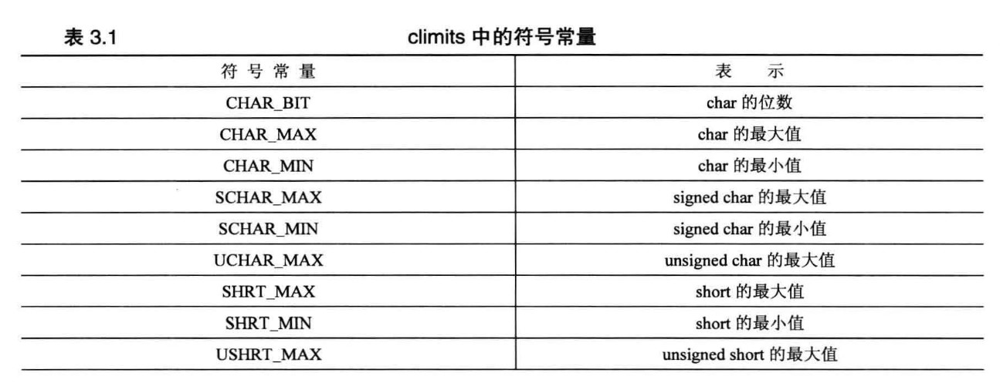
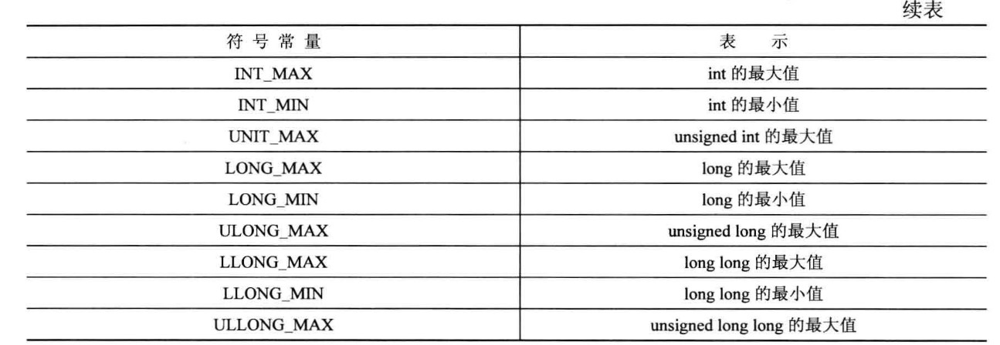
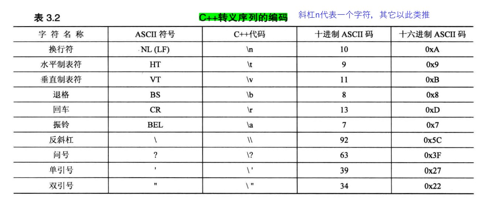

#### 整型 short、 int 、 long 和 long long长度

short 至少 16 位；
int 至少与 short 一样长；
long 至少 32 位，且至少与 int 一样长；
long long 至少 64 位，且至少与 long 一样长 。

#### climits中的符号常量

#### 后缀

整数后面的 l 或 L 后缀表示该整数为 long 常量， u 或 U 后缀表示 unsigned int 常量， ul(可以采用任何一种顺序，大写小写均可）表示 unsigned long 常量（由千小写 l 看上去像 1, 因此应使用大写 L 作后缀）。C++11 提供了用于表示类型 long long 的后缀 11 和 LL, 还提供了用于表示类型 unsigned long long 的后缀 ull 、 Ull 、 uLL 和 ULL。

如果希望常量为 float 类型， 请使用 f或 F 后缀。 对千 long double 类 型，可使用 1 或 L 后缀

#### C++转移序列的编码

#### 浮点型长度

C 和 C++对于有效位数的要求是， float 至少 32 位， double 至少 48 位，通常， float 为 32 位， double 为 64 位， long double 为 80 、 96 或 128 位。

float(二进制32位有效位,23位小数位,1位符号位,8位指数位)(23位小数位+1位整数位=24位有效位, 即十进制有 6位有效位）(24/4=6)

一个十进制数需要4个二进制数表示

指数位以127(中位数)为分隔，大于为正指数，小于为负，整数位常为1，故不需要存储

浮点常量在默认情况下为 double 类型。
